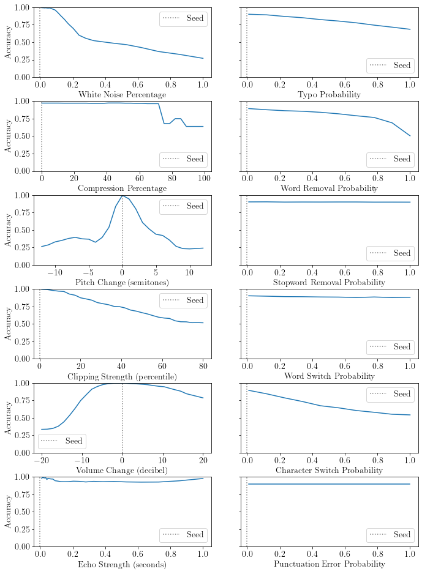

# Robustness Analysis of Machine Learning Models using Domain-Specific Test Data Perturbation
Authors: Marian Lambert, Thomas Schuster, Marcus Kessel, Colin Atkinson

## Abstract
This study examines how perturbations in image, audio, and text inputs affect the performance of different classification models. Various perturbators were applied to three seed datasets at different intensities to produce noisy test data. Then, the models' performance was evaluated on the generated test data. The findings indicate that there is a consistent relationship between larger perturbations and lower model performance across perturbators, models, and domains. However, this relationship varies depending on the characteristics of the specific model, dataset, and perturbator.

## Introduction
The growing use of machine learning systems in sensitive areas has spurred interest in ML testing, specifically their robustness to noisy data. However, understanding between the intensity of this data perturbation and model performance is limited, especially across diverse perturbations. Our research addresses this, offering an in-depth analysis across image, text, and audio domains, thereby informing strategies to improve ML model robustness.

## Literature Review
In the image domain, studies commonly find models significantly sensitive to noise, blur, and occlusion changes. Audio studies focus on the influence of noise, codecs, and compression techniques, while text-based research indicates that grammatical errors and corruption types impact NLP tasks differently. However, the review highlights an evident gap in the depth of research, particularly in the audio domain, indicating potential for further exploration.

## Experimental Setup
The experimental setup encompasses the application of various perturbations to test data from three datasets from the image, audio, and text domains, respectively. We utilized five different deep learning models to assess how differing perturbation strengths impact performance. The experimental design involves gradually increasing perturbation strength, with each model's effectiveness compared against various datasets utilizing metamorphic relationships to measure the impact on model output.

### Tested Models & Datasets
The following datasets and models were tested:

| | Image | Audio | Text |
|---|---|---|---|
| Model | [XCeption](https://keras.io/api/applications/xception/)   [InceptionResnetV2](https://keras.io/api/applications/inceptionresnetv2/)   [MobileNetV2](https://keras.io/api/applications/mobilenet/#mobilenetv2-function) | [Speaker Recognition CNN](https://keras.io/examples/audio/speaker_recognition_using_cnn/) | [Text Classification](https://keras.io/examples/nlp/text_classification_from_scratch/) |
| Dataset | [ImageNetV2](https://github.com/modestyachts/ImageNetV2) | [Speaker Recognition](https://www.kaggle.com/datasets/kongaevans/speaker-recognition-dataset) | [AclImDB](https://ai.stanford.edu/~amaas/data/sentiment/) |

## Results
Detailed results can be found in [`results/`](results/).

### Image
Our study shows that higher levels of perturbation significantly decrease model performance, as demonstrated in two sets of experiments on ImageNet models and speaker recognition/sentiment analysis models. The results indicate a negative correlation between perturbation strength and model performance across all models and perturbation types. The impact of perturbations was dependent on the type applied and the model's inherent capabilities. For instance, in ImageNet models, noise and occlusion perturbations caused rapid decline in performance, whereas performance against compression and pixelize perturbations deteriorated as the perturbation strength increased.

### Audio & Text
In the speaker recognition tests, white noise and compression perturbations increased with perturbation strength while pitch and volume perturbations showed more complex relationships. The sentiment analysis model performance decreased with increasing typo and word removal perturbations, while word switch perturbations had little effect, likely due to keyword-based classification strategies. All these findings are mostly consistent with previous research in the respective areas.

## Conclusion
Our experimental findings indicate that increased data perturbation can degrade model performance, with the correlation shape significantly affected by model and dataset characteristics, and perturbator type. Various perturbators displayed either or both linear and exponential correlations between perturbation strength and performance, suggesting the model's response to data noise significantly influences performance. Thus, comprehensive testing with diverse perturbators is recommended to reveal robustness issues affecting real-world performance. In future research, we aim to explore a broader range of models, datasets, and perturbations, including combined data perturbations, to understand their cumulative effects on model performance.